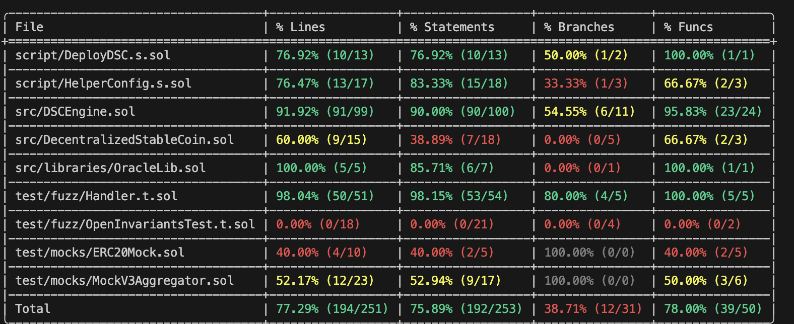

# DeFI Stablecoin Implementation #

### Create a stablecoins that fullfill these criteria: ###

__a. Relative Stabilitiy: Pegged/Anchored -> $1.00__

    1. Chainlink Pricefeed
    2. Exchange ETH & BTC -> $$$$

__b. Stability Mechanism (Minting): Algorithmic (Decentralized)__

    1. People can only mint the stablecoins with enough collateral (coded).
    2. Total collateral should always more than total minted coins.

__c. Collateral: Exogenous (Crypto)__

    People can deposit two types of collateral:

    1. wETH
    2. wBTC

### Test Done: ###
1. Unit Test
2. Fuzzing Test (Invariant)

### Test Converage: ###

